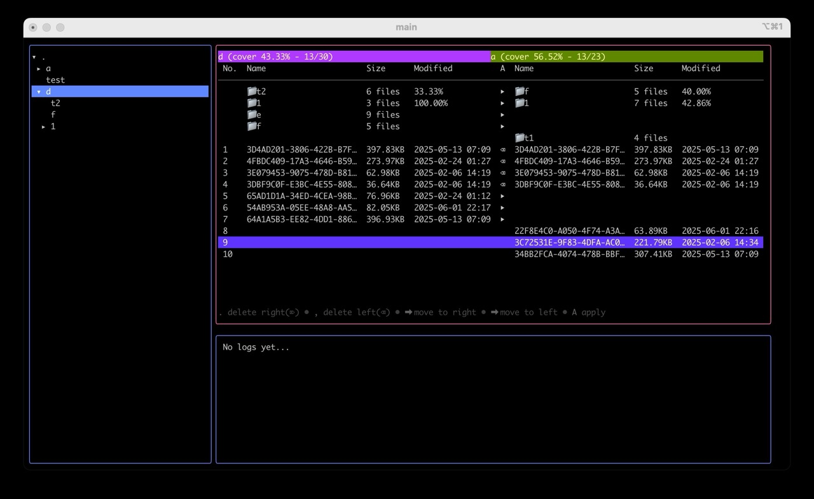
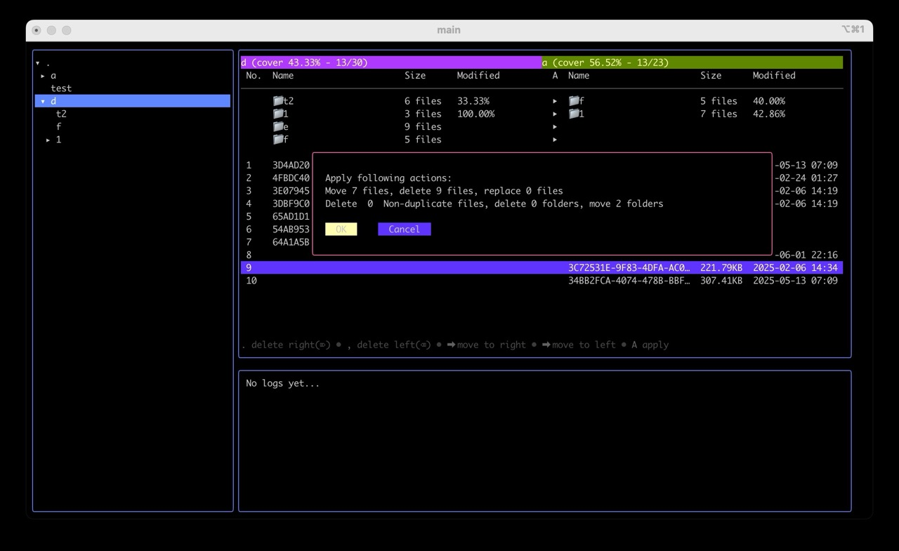
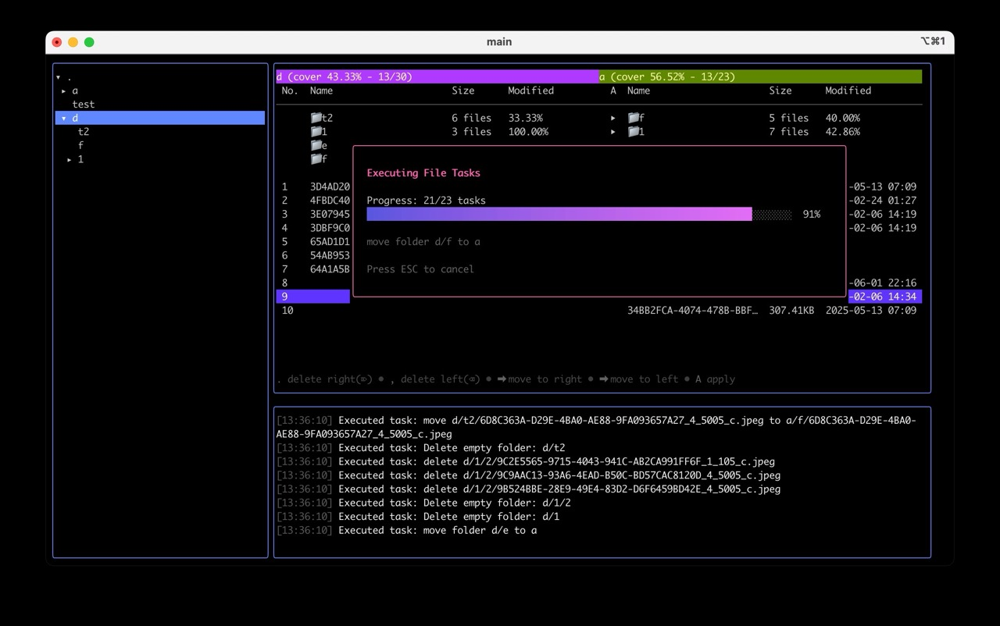
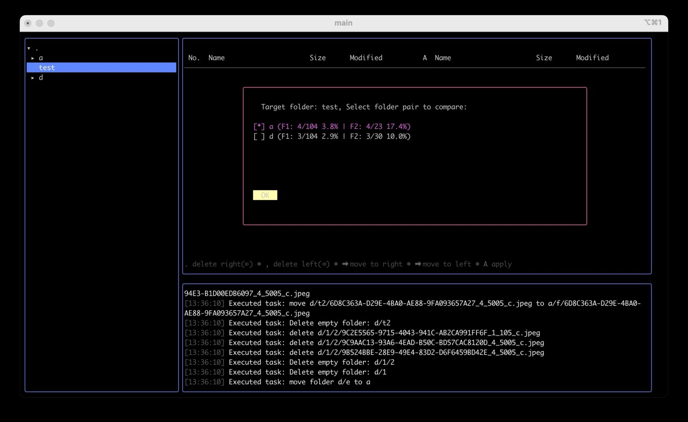

# Dedup TUI

## [Screenshot](./images)





## WARNING

This tools still in developing stage, it's not under the full test. Please use it on your own risk.

## Usage

```
go run main.go <root_path>
```

Fileview short cut:
| Key | Action |
| --- | --- |
| Enter | Select folder |
| Right | Move file/folder to right side |
| Left | Move file/folder to left side |
| `,` | Delete file/folder from left side |
| `.` | Delete file/folder from right side |
| `shift+right` | Move all file/folder to right side |
| `shift+left` | Move all file/folder to left side |
| `>` | Delete all file/folder from right side |
| `<` | Delete all file/folder from left side |
| `c` | Clear single actions |
| `shift+c` | Clear all actions |
| `A` | Apply actions |
| Tab | Toggle file view |
| `ctrl+c` | Exit |

## Build

```
go build -o dedup
```

## Limitation

- only scan the file from single path
- only do the partial file Hash

## TODO

- Add test case in core package
- Support multi root path for scanning
- Add rename feature to follow target folder name sequence
