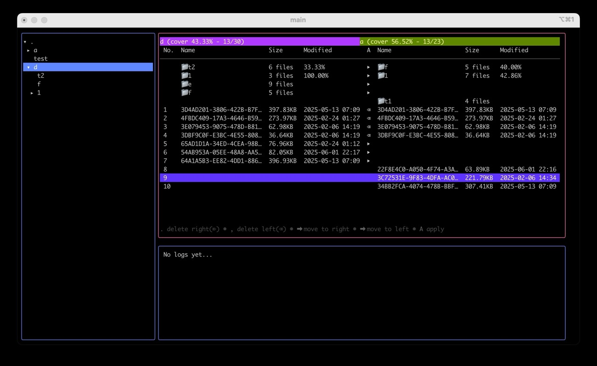
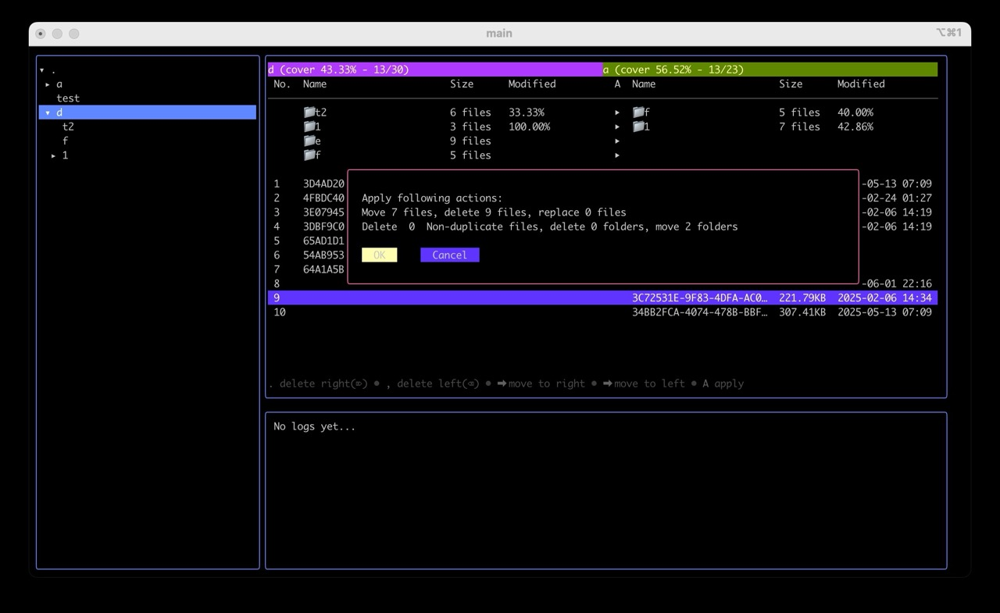
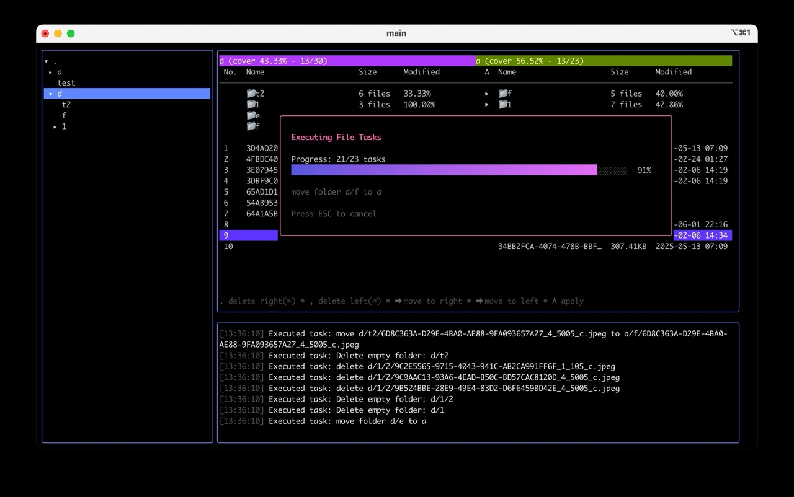
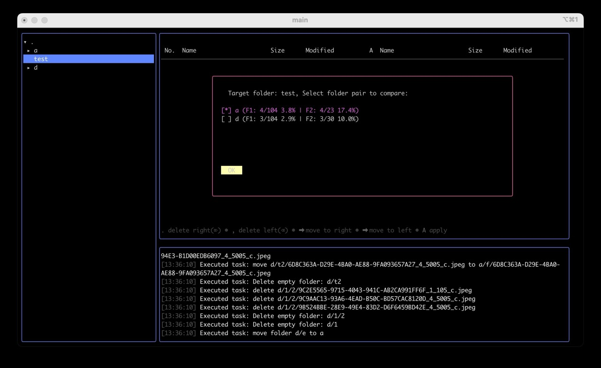

# Dedup TUI

## Screenshot
   

## WARNING

This tools still in developing stage, it's not under the full test. Please use it on your own risk.

## Usage

### Terminal UI (Bubble Tea)

```
go run ./cmd/tui <root_path>
```

### Desktop (Wails v3, phases 0–1 shell)

Install the v3 CLI (match [go.mod](go.mod) `github.com/wailsapp/wails/v3`):

```
go install github.com/wailsapp/wails/v3/cmd/wails3@v3.0.0-alpha.78
```

Check the environment:

```
wails3 doctor
```

Development (live reload; requires [Task](https://taskfile.dev) or run the equivalent `wails3 dev` from [Taskfile.yml](Taskfile.yml)):

```
task dev
```

Or without Task (the CLI defaults to `./build/config.yml`):

```
wails3 dev
```

Production-style build (outputs `bin/folder-similarity` on macOS):

```
wails3 build DEV=true
```

The default `go run .` entry point builds the **Wails** app. Rebuild the embedded UI after frontend changes: `cd frontend && npm run build` (or use `wails3 build` / `task dev`).

**Phases 2–3 (desktop):** after data loads (scan or JSON), the UI shows a read-only **folder tree**, **compare table**, and a **log** fed by scan progress.

**Phase 4 (desktop):** the compare pane is **interactive** (row actions, bulk actions, TUI-style shortcuts: `,` `.` arrows, `<` `>` shift+arrows, `c` / backspace, `C` clear all, `A` apply **preview**). If several similarity groups match a folder, use the **group** bar, then the table. **Apply (preview)** lists planned `FileActionTask` lines only — the executor (phase 5) is not run yet. Re-run `wails3 generate bindings` after changing Go service APIs.

**Phases 5–6 (desktop):** **Apply (run on disk)** runs the same executor as the TUI, with **progress** and **cancel**; after success the view **refreshes** like the TUI’s Refresh. **Phase 6** adds **Export JSON** (save dialog; same in-memory export as the TUI’s `db.json` flow) and **Open left / right folder** in the system file manager when you have a real **scan root** (not JSON-only with no on-disk root).

Fileview short cut:
| Key | Action |
| --- | --- |
| Enter | Select folder |
| Right | Move file/folder to right side |
| Left | Move file/folder to left side |
| `,` | Delete file/folder from left side |
| `.` | Delete file/folder from right side |
| `shift+right` | Move all file/folder to right side |
| `shift+left` | Move all file/folder to left side |
| `>` | Delete all file/folder from right side |
| `<` | Delete all file/folder from left side |
| `c` | Clear single actions |
| `shift+c` | Clear all actions |
| `A` | Apply actions |
| Tab | Toggle file view |
| `ctrl+c` | Exit |

## Build

### TUI binary

```
go build -o dedup ./cmd/tui
```

### Wails desktop binary

Includes embedded `frontend/dist`:

```
wails3 build DEV=true
```

### Platform-specific builds

The repo ships per-platform Taskfiles under `build/` (see [build/darwin/Taskfile.yml](build/darwin/Taskfile.yml) and [build/windows/Taskfile.yml](build/windows/Taskfile.yml)).

#### macOS

```
wails3 task darwin:build
```

#### Windows amd64 — without video thumbnails

Pure-Go cross-compile from macOS/Linux (`CGO_ENABLED=0`, no FFmpeg). Fastest path; the resulting `.exe` will not generate video thumbnails.

```
wails3 task windows:build
```

#### Windows amd64 — with video thumbnails

Video gallery thumbnails depend on `github.com/asticode/go-astiav`, which requires `CGO_ENABLED=1` plus matching FFmpeg development libraries.

**Option A — Cross-compile from macOS/Linux via Docker (recommended):**

The `wails-cross` image bundles FFmpeg n8.0 win64-gpl-shared dev libs (amd64 only).

```
# One-time: build the cross image (~150MB download for FFmpeg)
wails3 task setup:docker

# Build the .exe (Docker Desktop must be running)
wails3 task windows:build:cross:with-videothumb
```

The produced `.exe` lands in `bin/` next to the required `avcodec`/`avformat`/`avutil`/`swscale`/`swresample` DLLs — ship them together.

**Option B — Native build on Windows (MSYS2 UCRT64):**

1. Install [MSYS2](https://www.msys2.org/).
2. In the **MSYS2 UCRT64** shell:
   ```
   pacman -S --needed mingw-w64-ucrt-x86_64-gcc mingw-w64-ucrt-x86_64-pkg-config mingw-w64-ucrt-x86_64-ffmpeg
   ```
3. Use the same shell (or prepend `C:\msys64\ucrt64\bin` to `PATH`).
4. Export `PKG_CONFIG_PATH` (Git Bash example):
   ```
   export PKG_CONFIG_PATH=/ucrt64/lib/pkgconfig
   ```
5. Build:
   ```
   wails3 task windows:build:with-videothumb
   ```

#### Packaging (Windows)

NSIS installer (default) or MSIX:

```
wails3 task windows:package                 # NSIS
wails3 task windows:package FORMAT=msix     # MSIX
```

## Limitation

- only scan the file from single path
- only do the partial file Hash

## TODO

- Add test case in core package
- Support multi root path for scanning
- Add rename feature to follow target folder name sequence
